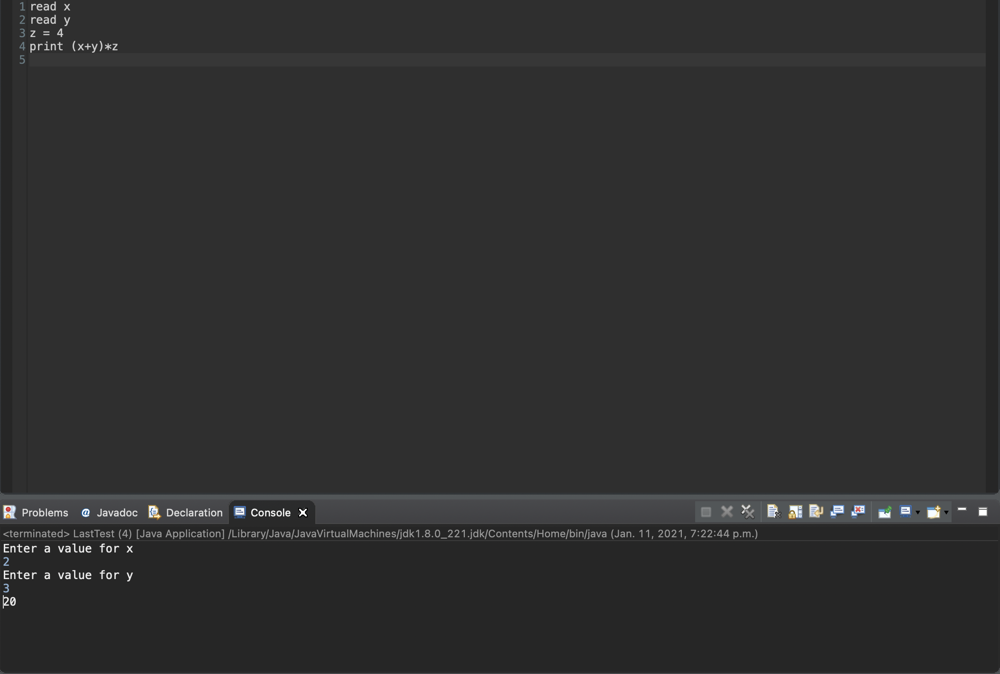
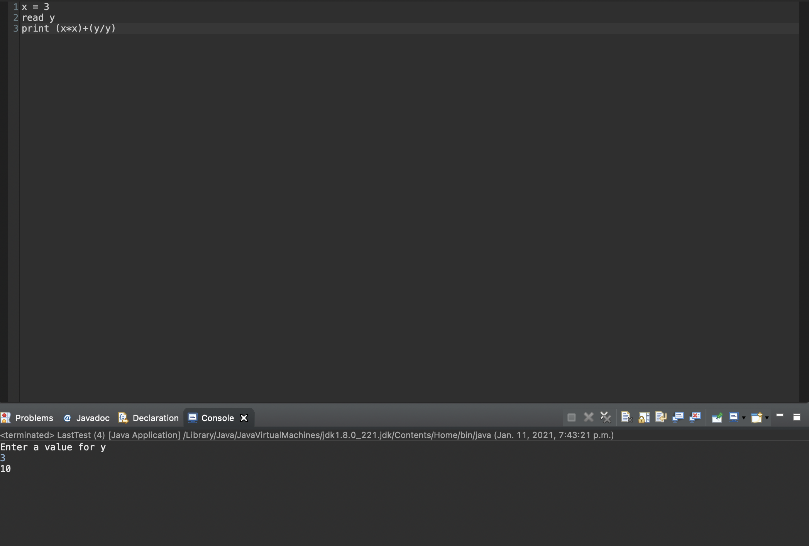
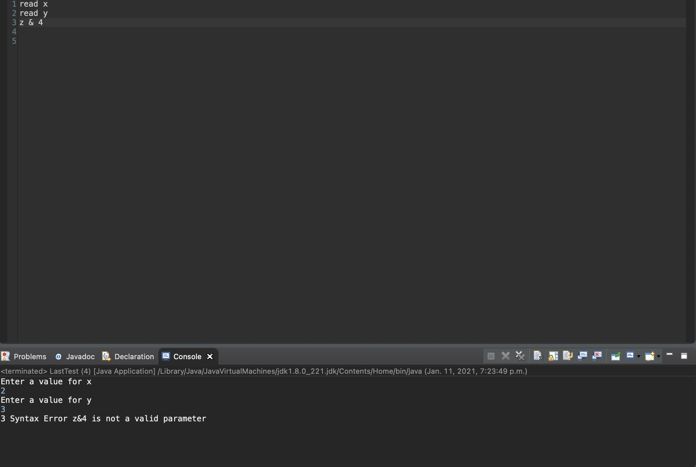

# Interpreter

Interpreter built on Java that can handle basic arithmetic operations

.txt file is used as the interface for the user,(for current project text file placed in folder)

Operations supported:
read-take variable input from user
print-display output

- (+) addition
- (-)subtraction
- (/)division
- (%) modulo

- () brackets used for order of operations

All other inputs considered syntax errors

Variables can be assigned similair to that of a programming language
i.e

x=3
y=3
print x*y
output: 9

Example screen shots

